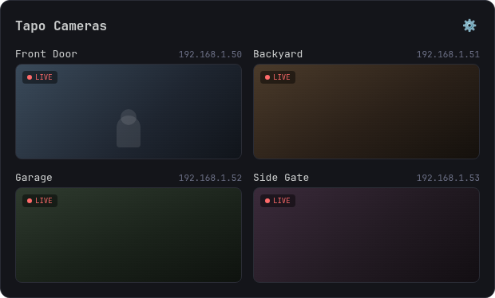

# Tapo Cameras — Omarchy Plugin



An [Omarchy](https://omarchy.org) plugin that adds a bar icon for quickly
viewing your TP-Link Tapo cameras. Click the icon to see a live preview of
each camera; click a preview to open its full RTSP stream in `mpv`, tiled
into your workspace.

This is a `bar-widget` plugin: a single QML entry point (`Panel.qml`) that
renders both the bar icon and its floating popup, with two views — the
camera list, and a settings screen (the cog icon) for adding, editing,
hiding, removing, and testing cameras without ever hand-editing a config
file.

## Requirements

- Omarchy with plugin support (`omarchy plugin` commands)
- Qt Multimedia with the FFmpeg backend (`qt6-multimedia` on Arch), used
  for the live preview
- [`mpv`](https://mpv.io) and [`ffprobe`](https://ffmpeg.org) (part of
  `ffmpeg`) — mpv plays the full stream on click, ffprobe powers the
  settings screen's "Test" button
- Tapo cameras with RTSP enabled and a **camera account** configured (see
  below) — most plugged-in Tapo cameras (C1xx/C2xx/C3xx series) support
  this; battery-powered doorbells and battery cameras generally don't, since
  they stream through TP-Link's cloud only and have no local RTSP option

## Install

```sh
omarchy plugin install https://github.com/ZestyBytes/omarchy-plugin-tapo
```

Or manually:

```sh
git clone https://github.com/ZestyBytes/omarchy-plugin-tapo \
  ~/.config/omarchy/plugins/io.github.zestybytes.tapo-cameras
omarchy plugin enable io.github.zestybytes.tapo-cameras
```

## Uninstall

```sh
omarchy plugin remove io.github.zestybytes.tapo-cameras
```

This removes the plugin itself; your camera list at
`~/.local/state/omarchy/tapo-cameras/cameras.json` is left in place
(delete it separately if you want it gone too — it holds your camera
credentials, see below).

## Set up your cameras

Everything happens from the bar — no config file editing required:

1. Click the camera icon in the bar.
2. Click the cog icon (top right of the panel) to open **Camera Settings**.
3. Click **+ Add camera** and fill in:
   - **Name** — whatever you want it labeled as
   - **IP address** and **port** (554 by default) — the camera's local
     network IP; check your router's connected-devices list or the Tapo
     app's device info screen
   - **Username / password** — a **camera account**, created in the Tapo
     app: open the camera → gear icon → Advanced Settings → Camera Account.
     This is a separate login from your TP-Link cloud account, created
     specifically for local RTSP/ONVIF access.
   - **Stream** — `stream1` (HD) or `stream2` (SD, lower bandwidth)
4. Click **Test** to confirm it connects.
5. Click the back arrow — your camera now shows a live preview in the panel.

The eye icon toggles a camera hidden from the main view without deleting
it; the trash icon removes it entirely.

### Config file (optional, for bulk setup or scripting)

Settings are stored at `~/.local/state/omarchy/tapo-cameras/cameras.json`
(see `cameras.json.example` for the shape). This lives outside the plugin's
own directory deliberately — Omarchy hot-reloads a plugin whenever a file
under its plugin directory changes, so keeping per-user config there caused
the whole widget to reload on every save.

- **This file holds camera credentials in plaintext.** The plugin creates
  it with `600` permissions; keep it that way, since anyone with read
  access to it gets RTSP access to your cameras.
- Hand-edits aren't picked up live — they're read the next time you open
  the panel.

## How it works

- `Panel.qml` — the whole plugin: bar icon, the camera-list popup (live
  video via Qt Multimedia, click to open the full stream in `mpv`), and the
  settings popup (add/edit/hide/remove/test, all reading and writing
  `cameras.json`).
- `CameraModel.js` — parses/serializes `cameras.json` and builds the
  `rtsp://user:pass@ip:port/streamN` URL for each camera.

2+ cameras tile into a grid (1 camera fills the width); drag a settings
row's grip handle to reorder the list.

## Roadmap / ideas

- PTZ controls (pan/tilt/zoom) for supported models
- ONVIF discovery to help find cameras' IPs automatically
- Confirmation before removing a camera

## License

MIT
